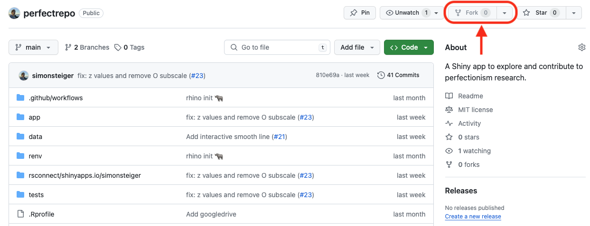

# Global Perfectionism Observatory 

[](https://zenodo.org/doi/10.5281/zenodo.13333232)

A [Shiny app](https://simonsteiger.shinyapps.io/perfectrepo) to explore real-time, open access data tracking levels of perfectionism among young people.

------------------------------------------------------------------------------------

## Installation

Begin by [forking](https://docs.github.com/en/pull-requests/collaborating-with-pull-requests/working-with-forks/fork-a-repo) the repository.



Next, clone the repository from your fork to your local machine:

```
git clone https://github.com/yourusername/perfectrepo
```

Once downloaded, activate [renv](https://rstudio.github.io/renv/articles/renv.html) and restore the project environment:

```r
renv::activate()
renv::restore()
```

Now, the dependencies of the app should be installed.
For troubleshooting, refer to the renv documentation linked above.
A good start is to look at the output of `renv::status()`.

You are now ready to run the app locally:

```r
rhino::app()
```

## Cite

*TODO*: Replace citation with correct info. Choose a suffix for article shorthand (XXXX).

```bibtex
@article{pose2024XXXX,
  title={This is a placeholder title},
  author={Curran, Thomas and Pose, Pia Marie and Hill, Andrew and Steiger, Simon},
  journal={Placeholder journal name},
  year={2024}
}
```
